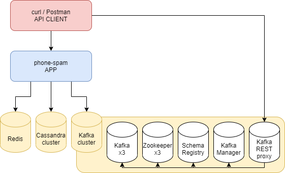

# phone-spam

This is a fun, experimental project for trying out interesting libraries and technologies, architectural and coding
approaches, working out bugs and quirks. Generally, throwing stuff at the wall and seeing what sticks.

It should by no means be treated as an example of a production-ready app. There are bugs, misconfigurations and missing
features. There is way too little error handling. Also, beware - no code reviews and little to no testing :)

## Use Cases

Imagine you're unlocking your phone, and you see a missed call from an unknown number. You want to know who called you,
is it something important? Do you need to call them back? Is it another MLM scheme? Is this a scam meant to skyrocket
your phone bill?

You want a website where you could check this number before calling back, and later possibly report whether it's safe or
not. Unsurprisingly, there's a lot of such sites already. Let's try designing something similar.

### Use case #1 - Summary

Allows for checking the latest reports for a given phone number. The system returns a list of: (username, rating,
comment) objects.

Exposed as REST Endpoint:

```
curl -XGET -s localhost:8080/reports/summaries --data '{"phoneNumber" : "1234567890"}'
```

### Use case #2 - Full Info

For (potentially, in the future) Premium clients, the system returns a full, paginated list of reports. Potentially, in
the future (again), we may add additional features here, such as phone number rating computed from all entries.

Exposed as REST Endpoint:

```
curl -XGET -s localhost:8080/reports --data '{"phoneNumber" : "66631"}'
```

### Use case #3 - Add report

Allows all users to add their own report for a given phone number in a form of: (phoneNumber, username, rating, comment)
objects.

```
curl -v localhost:8080/reports -XPOST --data '{"phoneNumber":"1234567890", "user":"test", "comment":"", "rating":"Dangerous"}' -H "Content-Type: application/json" 
```

### Use case #4 - Latest

To make the front page more appealing, the system returns a list of phone numbers that were lately reported.

```
curl -XGET localhost:8080/reports/latest
```

### Use case #5 - Top

To make the front page more appealing, the system returns a list of phone numbers that have been reported the most
times.

```
curl -XGET localhost:8080/reports/top
```

## Architecture

In a local setup, there is a single `phone-spam` backend service instance, as running multiple instances would be a big
overkill.

It communicates with the following components:

* Cassandra - storage for the full Report lists
* Kafka + Schema Registry - Report event log
* Redis - storage for pre-computed resources, like Latest, Summary, Top



### Processing flow

1. Phone Report requests are received by the `phone-spam` backend, validated, transformed into Events, and produced to a
   Kafka topic.
1. `phone-spam` backend also includes a consumer for this topic, which processes Events, and uses the results to update:
   Latest, Summary and Top in Redis, as well store the new report in Cassandra.
   (In the real world we probably would create separate micro/nano-services with their own consumers for each Use Case,
   with Redis updates being triggered by the insert into Cassandra)

## Technologies

### Application architecture

The application code is split into "modules", which are meant to encapsulate the private module components and provide a
safe way of obtaining public components with long-running tasks bound to the app lifecycle. They also allow for
integration testing in the module context, without having to pull the full application context, risking long startup
times.

(Note that due to having to fit all the app logic in a single project (for convenience), and due to laziness when
refactoring, the relations between modules are a bit messy - see how `kafkaReportConsumer` is built in `AppSetup`. It
would look better if UseCases were split into their own components).

The following components are bound to the application lifecycle:

* HTTP server
* Kafka Consumer
* Kafka Producer
* (a client for streaming Redis operations - e.g. for pub-sub - would need the same approach, we don't use it that way,
  though)

### Tagless Final

This project uses the Tagless Final approach, meaning that most of the traits are parametrised with an `F` context,
e.g. `Xxx[F[_]]`, and the classes extending those traits decide which type-classes they require of `F` for their use
cases. They do it either by specifying type bounds, e.g.: `...[F[_] : Monad]` or by requiring an implicit type-class
value in the constructor, .e.g.: `class Xxx[F](...)(implicit Monad: Monad[F]) { ...`.

The actual implementation for `F` is chosen as late as possible, in this case it's the
main `pl.pburcon.phoneSpam.main.Main` class. Up until then the code operates on `F` with type-class bounds (which has
the side effect of not allowing some tailor-made `Task` methods for example). The `Main` class is responsible for
providing all necessary type-class instances for its chosen `F` implementation. It does it mostly by extending `TaskApp`
and `IOApp`, depending on chosen flavor. It's pretty easy to switch between both.

### Dependencies

This project is mainly built on top of:

* Cats - base type-classes for Tagless Final
* Cats Effect - type-classes related to handling side effects, provides an `F` implementation - `cats.effect.IO`
* FS2 - streaming operations (Kafka client, http4s internals)
* http4s - HTTP server
* Monix - provides an `F` implementation - `monix.eval.Task`

Connector libraries:

* FS2 Kafka - pure, FS2-based Kafka client
* Phantom - Cassandra connector
* redis4cats - pure, Cats Effect- and FS2-based Redis client
* Vulcan - pure Schema Registry Avro client for FS2 Kafka

Additional libraries:

* Chimney - for auto-generating bolierplate related to case class translations (eg. from/to DTOs)
* Circe - for all serialization/deserialization needs
* kebs-tagless - tagged types implementation
* log4s + slf4j + log4j2 - idiomatic Scala logging with log4j2 backend via slf4j
* Pure Config - cats-based config
* ScalaMock + ScalaTest

## Running the app

### Phone-spam application

To run the application, execute `sbt run` from the project root. But in order for it to go up, you must also run the
local environment. See the next section.

### Local environment

I'm a big fan of providing single-command utilities for all endlessly and mindlessly repeated workflow tasks, as well as
for setting up new developers. Thanks to that you wil be able to run the full local environment just by executing
the `devtools/environment/local-[cluster|simple]/bin/run` script (provided you have Docker installed). There are other
helper scripts whose names should be self-explanatory.

Local environment is ephemeral, meaning no data is persisted once it's stopped.

### ! Data cap notice !

The `run` script will pull all `phone-spam` library dependencies as well as Docker images necessary for running the
environment, so make sure you're not paying per MB! It's a full kafka cluster setup + cassandra cluster + redis, so not
a negligible amount. For a list of Docker images see the `docker-compose.yml` file.

Also, running the full `local-cluster` environment uses up quite a lot of RAM, so be mindful if your machine is not up
to date.

### CURL AWAY!

Now, once everything is up, you can curl to your heart's content :)

Have fun!